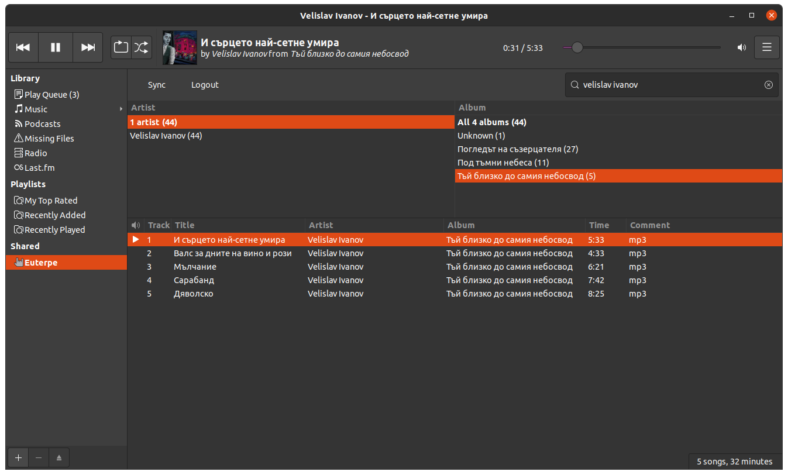

# HTTPMS Plugin for Rhythmbox

Using this plugin you can listen to your music served from a [HTTPMS server](https://github.com/ironsmile/httpms) directly in Rhythmbox.

## Installation

Create a directory and place the contents of this repository under one of the following:

* `$HOME/.local/share/rhythmbox/plugins` - install for a single user
* `/usr/lib/rhythmbox/plugins` - install for all users

## Configuration

_Insert configuration instructions here_

## Usage

After activating the plugin you will see a "HTTPMS" tab in the "Shared" group. In it you can use the "Search" menu to find your music.

## Development

If you want to help with the development, please do open an issue and then explain what you want to do. This will allow us to get the discussion rolling before any code is written and will prevent wasting time.

As to help with development resources, I am at a loss. Plug-in development and development as a whole for GTK is a jungle. One have to fend for himself and don't expect any reasonable documentation. The following have been of great help for me:

* The [Rhythmbox plug-in development guide](https://wiki.gnome.org/Apps/Rhythmbox/Plugins/WritingGuide).

* The [GTK API reference](https://lazka.github.io/pgi-docs/#RB-3.0/classes/Source.html#rb-source-fields). This includes the Rhythmbox API as well.

But really, almost nothing is documented. And where there are guides and documentation they are almost 100% out of date. Good luck!

## TODO

* ~~Settings for setting the HTTPMS address and access tokens~~
* ~~Timeout in the search field. Searching should start 50-100ms after the user stops typing.~~
* Track time
* ~~Sort tracks after search~~ (sort of done)
* ~~Preserve Browser size~~
* Logout Button
* Automatic Logout on wrong credentials
